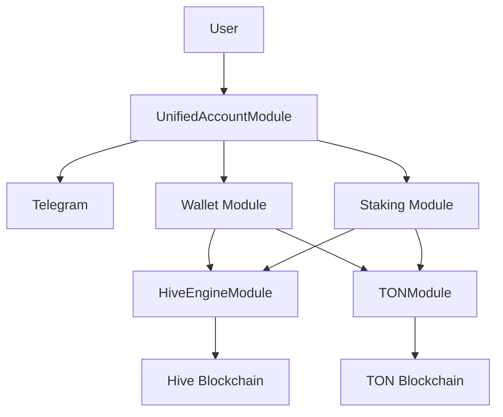

# Architecture Diagrams & Visuals

## System Overview

## Module Interactions
- **UnifiedAccountModule** enforces 2FA for token-moving actions and manages user authentication.
- **Wallet Module** handles balances and transfers, integrating with Hive and TON via respective modules.
- **Staking Module** manages pools, staking, and rewards, also integrating with blockchains. 